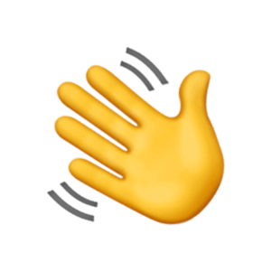

<h1 class="flex">&nbsp;Hi, I'm Maalik</h1>

  <samp>
    <a href="https://ashternext.com" target='_blank'>ashternext.com</a> .
    <a href="https://medium.com/@maalik" target='_blank'>blog</a>
  </samp>

I'm Malik Bagwala, founder of [AshterNext](https://ashternext.com). We're obsessed with creating exceptional customer and user experiences, supercharged by AI. We design and build apps, websites, SaaS platforms and design systems that are easy to use, good to look at, and help people and brands reach their business goals.

**How we work**

1. **Users first:** Every project starts with a deep understanding of the people who will use it. Product design leads, and the code follows.

2. **Supercharged by AI:** AI is part of what we build and how we build it, wherever it makes the experience better for your users.

3. **Thoughtful technology choices:** Technical expertise matters a little differently in this day and age. We choose the technology, AI included, that delivers the best solution for your business, not just the one we know best.

- 🏢 Founder of [AshterNext](https://ashternext.com), a software studio in Nashik, India.
- 🤖 Building AI and LLM-powered products alongside web, mobile and SaaS.
- 🛠️ Usually working with React, Next.js, TypeScript, Flutter, Node.js, Python, Django, GraphQL, PostgreSQL, AWS and Kubernetes, picked to fit the problem.
- 💬 Ask me about product design, customer experience, building with AI, React or Django.
- 📫 Reach me at [malik@ashternext.com](mailto:malik@ashternext.com) or on [Telegram](https://t.me/ashterb).

#### Building something your users should love? Let's talk.

 

### Statistics

